# 5.8 接口视角 (Interface Viewpoint)

接口视角详细描述了 FitnessAI 系统中各组件之间、系统与外部环境之间的接口契约。本视角关注接口的语法（签名、参数）、语义（行为契约）及非功能属性（性能、可靠性），为系统集成与测试提供精确的接口规约。

## 5.8.1 接口分类与层次

FitnessAI 系统的接口按层次划分为三类：

### 5.8.1.1 外部接口（External Interfaces）

系统与外部实体（用户、浏览器运行时、第三方服务）的交互边界。

**用户界面接口**：
- **GUI 交互契约**：基于 React 的事件驱动模型，用户通过点击、拖拽等手势触发状态变更
- **视觉反馈契约**：Canvas 2D 渲染接口，以 30fps 频率绘制骨骼覆盖层

**浏览器运行时接口**：
- **MediaDevices API**：`getUserMedia(constraints)` 获取摄像头流，返回 `MediaStream` 对象
- **WebRTC 接口**：视频流捕获与处理
- **Fetch API**：HTTP 请求接口，用于前后端通信

**第三方服务接口**：
- **智谱 AI OpenAPI**：RESTful HTTP 接口，遵循 OpenAPI 3.0 规范

### 5.8.1.2 内部组件接口（Component Interfaces）

系统内部组件间的接口契约，包括前端模块间、后端服务层间及前后端之间的接口。

**前端组件接口**：
- **usePoseDetection Hook 接口**：暴露 `{ videoRef, canvasRef, isActive, exerciseStats, startDetection, stopDetection, resetStats }`
- **SquatClassifier 接口**：深度学习推理接口 `predict(landmarks: Landmark[]): SquatState`，返回状态分类及置信度

**后端服务接口**：
- **RESTful API 接口**：遵循 REST 风格，JSON 序列化
- **Repository 接口**：数据访问抽象层，定义 `save()`, `findById()`, `findByUserId()` 等方法

### 5.8.1.3 数据接口（Data Interfaces）

跨越系统边界的数据结构定义，包括请求/响应载荷、数据库 Schema。

**API 数据契约**：
- **请求载荷**：JSON 格式，包含 `exercise_type`, `pose_data`, `user_id` 等字段
- **响应载荷**：JSON 格式，包含 `session_id`, `analysis_result`, `feedback` 等字段

## 5.8.2 RESTful API 接口规约

后端暴露的 RESTful API 接口遵循统一的设计原则：资源导向、无状态、幂等性。

### 5.8.2.1 认证接口组

**接口标识**：`/api/auth/*`

| 接口路径 | HTTP 方法 | 功能 | 请求体 | 响应体 | 认证要求 |
|---------|----------|------|--------|--------|---------|
| `/api/auth/register` | POST | 用户注册 | `{ username, password, email?, nickname? }` | `{ token, user }` | 无 |
| `/api/auth/login` | POST | 用户登录 | `{ username, password }` | `{ token, user }` | 无 |
| `/api/auth/me` | GET | 获取当前用户信息 | 无 | `{ user_id, username, nickname, email, profile }` | Bearer Token |
| `/api/auth/change-password` | POST | 修改密码 | `{ old_password, new_password }` | `{ message }` | Bearer Token |

**接口契约细节**：
- **认证机制**：JWT Token，通过 `Authorization: Bearer {token}` Header 传递
- **Token 有效期**：24 小时
- **密码安全**：SHA-256 哈希存储，最小长度 6 位

### 5.8.2.2 会话管理接口组

**接口标识**：`/api/session/*`

| 接口路径 | HTTP 方法 | 功能 | 请求体 | 响应体 | 认证要求 |
|---------|----------|------|--------|--------|---------|
| `/api/session/start` | POST | 开始训练会话 | `{ exercise_type, user_id? }` | `{ session_id, message }` | 可选 |
| `/api/session/{session_id}/data` | POST | 提交运动数据 | `{ pose_data, is_correct, score, feedback }` | `{ message, session_stats }` | 无 |
| `/api/session/{session_id}/end` | POST | 结束训练会话 | 无 | `{ session_id, summary }` | 无 |

**接口契约细节**：
- **会话 ID 格式**：`{user_id}_{YYYYMMDD_HHMMSS}`
- **数据提交频率**：前端 Telemetry Buffer 批量提交，避免高频请求
- **会话状态**：`active` → `completed`

### 5.8.2.3 AI 服务接口组

**接口标识**：`/api/ai/*`

| 接口路径 | HTTP 方法 | 功能 | 请求体 | 响应体 | 认证要求 |
|---------|----------|------|--------|--------|---------|
| `/api/ai/generate-plan` | POST | AI 生成健身计划 | `{ height?, weight?, age?, gender? }` | `{ daily_goals, weekly_goals, suggestions, bmi, fitness_level }` | Bearer Token |

**接口契约细节**：
- **降级机制**：API Key 未配置或调用失败时，自动降级使用规则引擎
- **响应时间**：AI 调用超时 30 秒，重试 2 次
- **数据脱敏**：发送给 AI 的数据不包含用户 PII

## 5.8.3 前端组件接口规约

### 5.8.3.1 usePoseDetection Hook 接口

**接口签名**：
```typescript
interface UsePoseDetectionReturn {
  videoRef: RefObject<HTMLVideoElement>;
  canvasRef: RefObject<HTMLCanvasElement>;
  isActive: boolean;
  poseResults: PoseResults | null;
  exerciseStats: ExerciseStats;
  startDetection: () => Promise<void>;
  stopDetection: () => void;
  resetStats: () => void;
}
```

**接口行为契约**：
- **startDetection()**：异步初始化 MediaPipe，启动摄像头流，设置 `isActive = true`
- **stopDetection()**：停止摄像头流，释放资源，设置 `isActive = false`
- **resetStats()**：重置分析器状态，清零计数与得分

### 5.8.3.2 SquatClassifier 接口

**接口签名**：
```typescript
interface SquatClassifier {
  predict(landmarks: Landmark[]): SquatState;
  extractFeatures(landmarks: Landmark[]): number[];  // 24维特征向量
  reset(): void;
}

interface SquatState {
  state: 0 | 1 | 2;        // 0:站直, 1:半蹲, 2:完全蹲下
  confidence: number;       // 0-1，模型置信度
  probabilities: number[];  // [p0, p1, p2] 三种状态的概率
}
```

**接口行为契约**：
- **predict()**：执行深度学习模型推理，返回状态分类及置信度
- **extractFeatures()**：从关键点提取24维特征向量
- **reset()**：重置内部状态（EMA历史、状态计数器等）

## 5.8.4 接口图

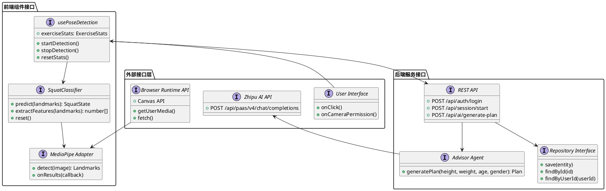

图5-16：系统接口层次图

## 5.8.5 接口非功能属性

### 5.8.5.1 性能约束

- **前端实时分析接口**：`analyze()` 方法执行时间 < 16ms（满足 60fps）
- **REST API 响应时间**：P95 < 200ms，P99 < 500ms
- **AI 接口超时**：30 秒，重试 2 次

### 5.8.5.2 可靠性约束

- **接口可用性**：REST API 可用性 ≥ 99.5%
- **错误处理**：所有接口返回标准错误格式 `{ error: string, message?: string }`
- **降级策略**：AI 接口失败时自动降级使用规则引擎

### 5.8.5.3 安全性约束

- **认证接口**：密码传输使用 HTTPS，存储使用 SHA-256 哈希
- **数据脱敏**：AI 接口调用前移除用户 PII
- **CORS 策略**：前端仅允许从 `http://localhost:3000` 访问后端

---

# 5.9 结构视角 (Structure Viewpoint)

结构视角描述系统的静态组织结构，包括模块的层次结构、组件间的组合关系及数据结构的组织方式。本视角通过包图、组件图及数据结构图，揭示系统的静态架构骨架。

## 5.9.1 系统层次结构

FitnessAI 系统采用**分层架构**，严格遵循**关注点分离**原则。系统从下至上分为四层：

### 5.9.1.1 表示层（Presentation Layer）

**职责**：用户界面渲染与交互事件处理。

**组件**：
- **App Container**：React 应用根容器，管理全局状态（AuthContext）
- **CameraView**：摄像头视图组件，集成视频流与 Canvas 覆盖层
- **StatsPanel**：实时统计面板，显示计数、得分、反馈
- **ExerciseSelector**：运动类型选择器
- **Profile**：用户资料管理界面

**设计模式**：组件化、状态提升（Lifting State Up）

### 5.9.1.2 业务逻辑层（Business Logic Layer）

**职责**：核心业务规则实现，不依赖 UI 或数据存储细节。

**前端业务逻辑**：
- **usePoseDetection Hook**：姿态检测生命周期管理
- **SquatClassifier**：深度学习模型推理引擎（特征提取、模型预测、结果平滑）
- **Telemetry Buffer**：数据缓冲与批量提交

**后端业务逻辑**：
- **SessionService**：会话业务编排
- **PoseAnalysisEngine**：姿态分析引擎
- **AdvisorAgent**：AI 代理服务

**设计模式**：策略模式、工厂模式、服务层模式

### 5.9.1.3 数据访问层（Data Access Layer）

**职责**：封装数据持久化逻辑，提供领域对象与数据存储的映射。

**组件**：
- **SessionRepository**：会话数据访问
- **UserRepository**：用户数据访问
- **PlanRepository**：健身计划数据访问

**设计模式**：仓储模式（Repository Pattern）

### 5.9.1.4 基础设施层（Infrastructure Layer）

**职责**：提供技术能力支撑，包括外部库适配、网络通信、数据存储。

**组件**：
- **MediaPipeAdapter**：MediaPipe 库适配器
- **ApiClient**：HTTP 客户端封装（Axios/Fetch）
- **DatabaseConnection**：PostgreSQL 连接池管理

**设计模式**：适配器模式、外观模式

## 5.9.2 前端模块结构

前端采用 **React + TypeScript** 架构，按功能域划分为以下模块：

### 5.9.2.1 核心模块（Core Modules）

```
frontend/src/
├── components/          # UI 组件
│   ├── CameraView.tsx
│   ├── ExerciseSelector.tsx
│   ├── StatsPanel.tsx
│   └── Profile.tsx
├── hooks/              # React Hooks
│   └── usePoseDetection.ts
├── utils/              # 工具函数
│   ├── featureExtractor.ts  # 特征提取算法
│   └── squatClassifier.ts   # 深度学习分类器
├── services/           # API 服务
│   └── api.ts
└── contexts/           # Context 提供者
    └── AuthContext.tsx
```

**模块依赖关系**：
- `components` → `hooks` → `utils` → `services`
- `components` → `contexts`（全局状态注入）

### 5.9.2.2 数据流结构

前端采用**单向数据流**（Unidirectional Data Flow）：
1. **用户交互** → 触发事件处理器
2. **事件处理器** → 调用 Hook 方法
3. **Hook** → 更新本地状态
4. **状态变更** → 触发组件重渲染
5. **组件** → 展示最新 UI

## 5.9.3 后端模块结构

后端采用 **Flask + Python** 架构，按分层原则组织：

### 5.9.3.1 模块划分

```
backend/
├── app.py              # Flask 应用入口，路由定义
├── pose_analyzer.py    # 姿态分析引擎
├── repositories/       # 数据访问层（未来扩展）
├── services/           # 业务服务层（未来扩展）
└── models/             # 领域模型（未来扩展）
```

**当前实现**：采用**扁平化结构**，所有逻辑集中在 `app.py`，符合小型项目快速迭代需求。未来可重构为分层结构。

## 5.9.4 数据结构组织

### 5.9.4.1 领域对象结构

**User（用户聚合根）**：
```typescript
interface User {
  user_id: string;
  username: string;
  password_hash: string;
  email: string;
  nickname: string;
  profile: {
    height: number;    // cm
    weight: number;    // kg
    age: number;
    gender: 'male' | 'female' | 'other';
  };
  created_at: string;  // ISO 8601
}
```

**Session（训练会话）**：
```typescript
interface Session {
  session_id: string;
  user_id: string;
  exercise_type: string;
  start_time: string;
  end_time: string | null;
  total_count: number;
  correct_count: number;
  scores: Array<{
    timestamp: string;
    score: number;
    is_correct: boolean;
    feedback: string;
    pose_data?: Landmark[];
  }>;
  status: 'active' | 'completed';
}
```

**ExerciseAnalysis（分析结果）**：
```typescript
interface ExerciseAnalysis {
  isCorrect: boolean;
  score: number;        // 0-100
  feedback: string;
  count?: number;
  duration?: number;    // 秒
}
```

## 5.9.5 结构图

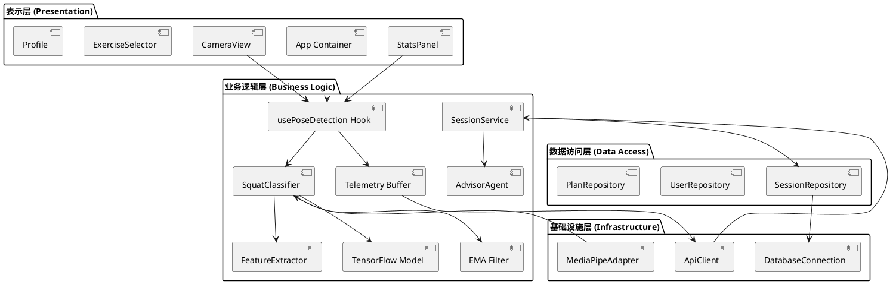

图5-17：系统分层结构图

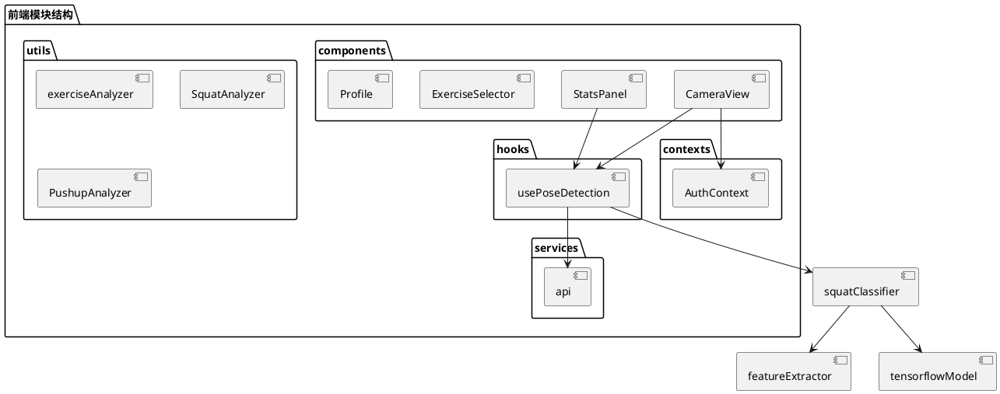

图5-18：前端模块结构图

---

# 5.10 交互视角 (Interaction Viewpoint)

交互视角描述系统组件之间的动态协作关系，通过时序图、协作图展示对象/组件在特定场景下的消息传递与调用序列。本视角重点关注关键业务流程中的组件交互模式。

## 5.10.1 核心交互场景

### 5.10.1.1 场景一：实时姿态检测闭环

**场景描述**：用户启动摄像头，系统实时检测姿态并给出反馈，整个过程无需后端参与。

**参与者**：
- User（用户）
- CameraView（视图组件）
- usePoseDetection（Hook）
- MediaPipeAdapter（适配器）
- SquatClassifier（深度学习分类器）
- Canvas（渲染层）

**交互序列**：

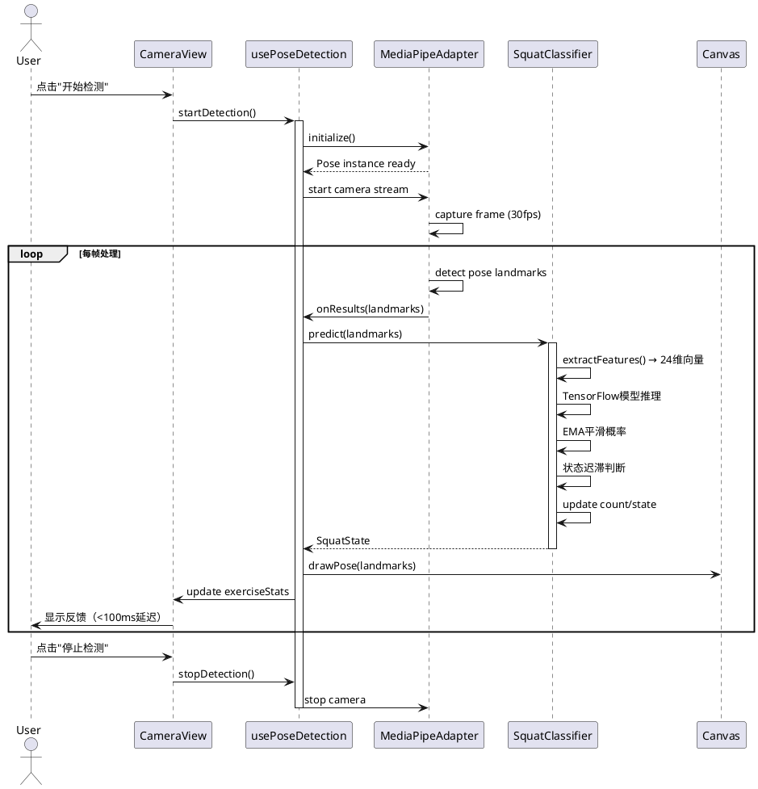

图5-19：实时姿态检测交互时序图

**关键交互点**：
1. **初始化阶段**：Hook 创建 MediaPipe 实例，配置检测参数
2. **实时处理循环**：30fps 帧率，每帧执行检测→分析→渲染→反馈
3. **低延迟保证**：整个闭环在浏览器内完成，延迟 < 100ms

### 5.10.1.2 场景二：训练会话生命周期

**场景描述**：用户开始训练，系统创建会话，持续提交数据，最后结束会话并生成报告。

**参与者**：
- Frontend（前端）
- SessionController（控制器）
- SessionService（服务层）
- SessionRepository（仓储层）
- Database（数据库）
- AdvisorAgent（AI 代理）

**交互序列**：

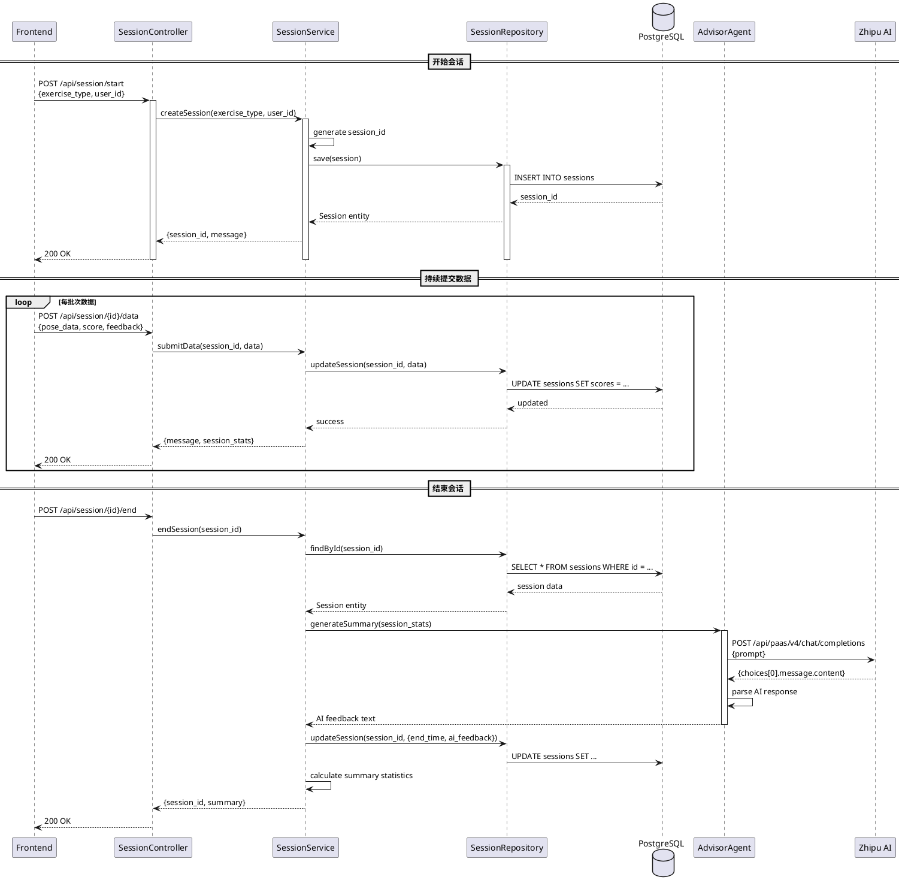

图5-20：训练会话生命周期交互时序图

**关键交互点**：
1. **会话创建**：前端发起请求，后端生成唯一 session_id
2. **数据提交**：Telemetry Buffer 批量提交，减少 HTTP 请求频率
3. **会话结束**：触发 AI 总结生成，异步调用外部服务

### 5.10.1.3 场景三：AI 健身计划生成

**场景描述**：用户请求 AI 生成个性化健身计划，系统调用智谱 AI API，解析返回结果。

**参与者**：
- Frontend（前端）
- AIController（AI 控制器）
- AdvisorAgent（AI 代理）
- ZhipuAI（外部服务）
- PlanRepository（计划仓储）

**交互序列**：

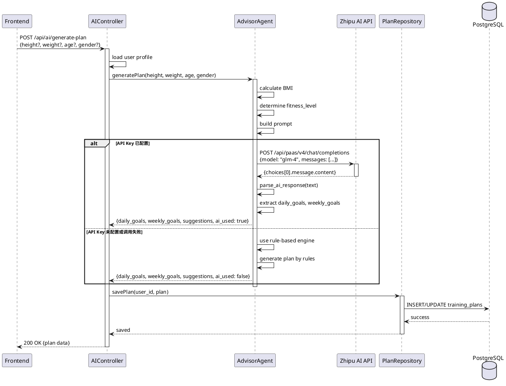

图5-21：AI 健身计划生成交互时序图

**关键交互点**：
1. **降级机制**：API 调用失败时自动使用规则引擎
2. **数据解析**：使用正则表达式提取结构化数据
3. **结果持久化**：生成的计划保存到数据库

## 5.10.2 组件协作模式

### 5.10.2.1 前端组件协作

前端采用**观察者模式**实现组件间通信：

- **usePoseDetection Hook** 作为**被观察者**（Subject），维护 `exerciseStats` 状态
- **StatsPanel** 作为**观察者**（Observer），订阅状态变更并自动更新 UI

### 5.10.2.2 后端服务协作

后端采用**服务层模式**实现业务编排：

- **Controller** 负责 HTTP 协议解析，调用 **Service** 执行业务逻辑
- **Service** 协调多个 **Repository** 和 **Agent**，实现复杂业务流程
- **Repository** 封装数据访问细节，向 Service 暴露领域对象接口

## 5.10.3 交互图

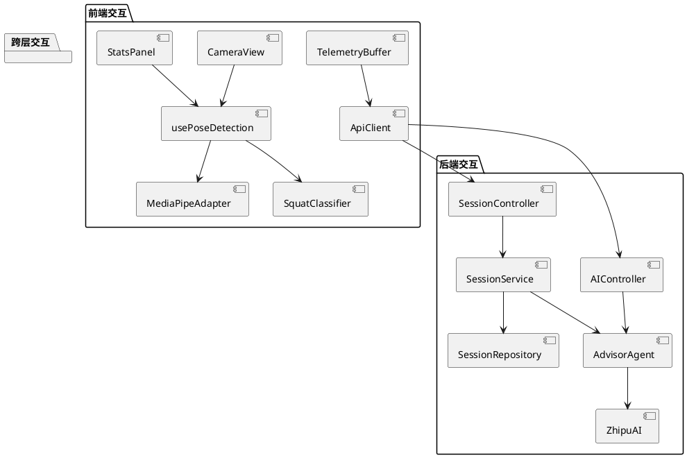

图5-22：组件协作关系图

---

# 5.11 状态动态视角 (State Dynamics Viewpoint)

状态动态视角描述系统及其组件在生命周期内的状态变迁，通过状态图、状态转换表揭示系统的动态行为模式。本视角重点关注关键实体的状态机模型。

## 5.11.1 训练会话状态机

**Session（训练会话）**是系统的核心状态实体，其生命周期包含以下状态：

### 5.11.1.1 状态定义

1. **INITIALIZED（已初始化）**：会话对象已创建，但尚未开始数据采集
2. **ACTIVE（活跃）**：会话正在进行，持续接收运动数据
3. **PAUSED（暂停）**：会话临时暂停，数据采集中断但会话未结束
4. **COMPLETED（已完成）**：会话正常结束，数据已保存，AI 总结已生成
5. **CANCELLED（已取消）**：会话异常终止，数据可能未完整保存

### 5.11.1.2 状态转换规则

| 当前状态 | 触发事件 | 下一状态 | 动作 |
|---------|---------|---------|------|
| INITIALIZED | start_session() | ACTIVE | 设置 start_time，初始化计数器 |
| ACTIVE | submit_data() | ACTIVE | 更新 scores 数组，累计计数 |
| ACTIVE | pause() | PAUSED | 暂停数据采集 |
| PAUSED | resume() | ACTIVE | 恢复数据采集 |
| ACTIVE | end_session() | COMPLETED | 设置 end_time，调用 AI 生成总结 |
| PAUSED | end_session() | COMPLETED | 设置 end_time，调用 AI 生成总结 |
| ACTIVE | cancel() | CANCELLED | 标记为取消，不生成总结 |
| PAUSED | cancel() | CANCELLED | 标记为取消 |
| INITIALIZED | cancel() | CANCELLED | 删除会话记录 |

### 5.11.1.3 状态图

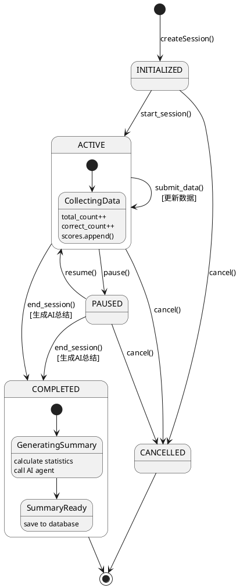

图5-23：训练会话状态机图

## 5.11.2 姿态检测状态机

**usePoseDetection Hook** 管理前端姿态检测的生命周期状态：

### 5.11.2.1 状态定义

1. **IDLE（空闲）**：Hook 已初始化，但未启动检测
2. **INITIALIZING（初始化中）**：正在加载 MediaPipe 模型和启动摄像头
3. **DETECTING（检测中）**：摄像头已启动，持续进行姿态检测
4. **ERROR（错误）**：检测过程中发生错误（如摄像头权限被拒绝）

### 5.11.2.2 状态转换规则

| 当前状态 | 触发事件 | 下一状态 | 动作 |
|---------|---------|---------|------|
| IDLE | startDetection() | INITIALIZING | 加载 MediaPipe，请求摄像头权限 |
| INITIALIZING | onMediaPipeReady() | DETECTING | 启动摄像头流，开始检测循环 |
| INITIALIZING | onError() | ERROR | 设置错误消息 |
| DETECTING | stopDetection() | IDLE | 停止摄像头，释放资源 |
| DETECTING | onCameraError() | ERROR | 设置错误消息 |
| ERROR | retry() | INITIALIZING | 重新初始化 |
| ERROR | reset() | IDLE | 重置状态 |

### 5.11.2.3 状态图

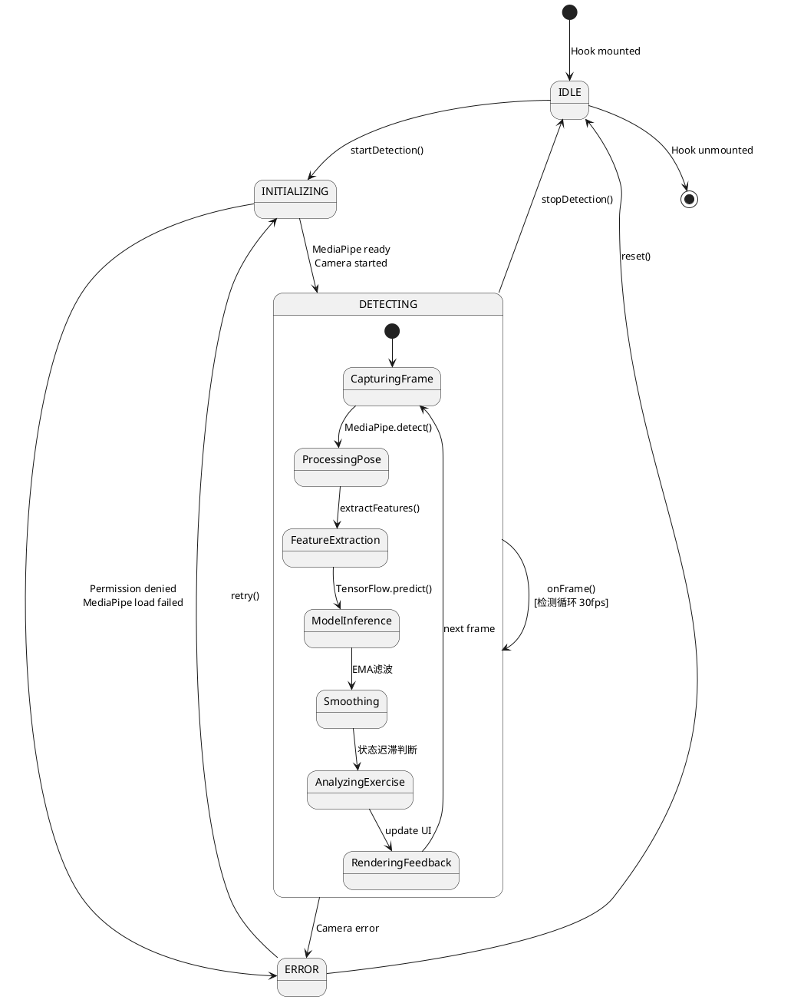

图5-24：姿态检测状态机图

## 5.11.3 运动分析器状态机

**SquatClassifier（深蹲分类器）**的状态机模型，基于深度学习模型的三类状态分类：

### 5.11.3.1 状态定义

深度学习模型输出三种状态分类：

1. **状态 0（站直）**：用户处于站立姿态，膝盖角度接近 $180^\circ$
2. **状态 1（半蹲）**：用户处于半蹲姿态，膝盖角度在 $90^\circ$ 至 $150^\circ$ 之间
3. **状态 2（完全蹲下）**：用户处于完全蹲下姿态，膝盖角度小于 $90^\circ$

### 5.11.3.2 状态转换规则

| 当前状态 | 条件 | 下一状态 | 动作 |
|---------|------|---------|------|
| 状态 0 | 模型预测状态1且置信度>0.7持续3帧 | 状态 1 | 进入半蹲阶段 |
| 状态 1 | 模型预测状态2且置信度>0.7持续3帧 | 状态 2 | 到达底部，记录时间戳 |
| 状态 2 | 模型预测状态1且置信度>0.7持续3帧 | 状态 1 | 开始起立 |
| 状态 1 | 模型预测状态0且置信度>0.7持续3帧 | 状态 0 | 完成一次，count++ |
| * | 置信度不足或异常 | 保持当前状态 | 等待稳定 |

**状态迟滞机制**：为防止状态边界反复跳变，仅当新状态的置信度**持续 3 帧**超过阈值 $0.7$ 时，才触发状态切换。

### 5.11.3.3 状态图

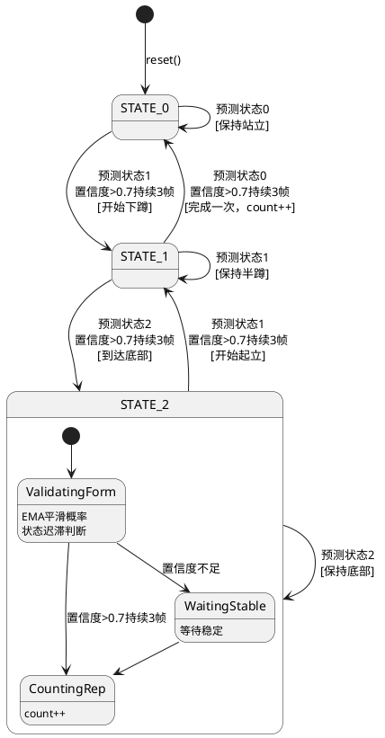

图5-25：深蹲分类器状态机图（基于深度学习模型）

## 5.11.4 用户认证状态机

**AuthContext** 管理用户认证状态：

### 5.11.4.1 状态定义

1. **UNAUTHENTICATED（未认证）**：用户未登录
2. **AUTHENTICATING（认证中）**：正在验证用户凭证
3. **AUTHENTICATED（已认证）**：用户已登录，Token 有效
4. **TOKEN_EXPIRED（Token 过期）**：Token 已过期，需要重新登录

### 5.11.4.2 状态转换规则

| 当前状态 | 触发事件 | 下一状态 | 动作 |
|---------|---------|---------|------|
| UNAUTHENTICATED | login(username, password) | AUTHENTICATING | 发送登录请求 |
| AUTHENTICATING | onSuccess(token) | AUTHENTICATED | 保存 Token，设置用户信息 |
| AUTHENTICATING | onError() | UNAUTHENTICATED | 显示错误消息 |
| AUTHENTICATED | logout() | UNAUTHENTICATED | 清除 Token |
| AUTHENTICATED | tokenExpired() | TOKEN_EXPIRED | 清除 Token，提示重新登录 |
| TOKEN_EXPIRED | login() | AUTHENTICATED | 重新认证 |

### 5.11.4.3 状态图

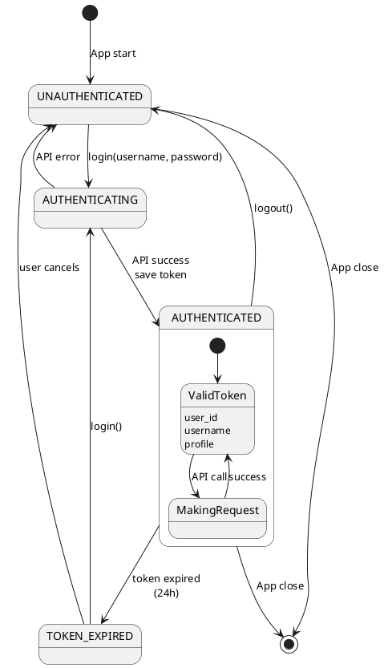

图5-26：用户认证状态机图

---

# 5.12 算法视角

算法视角详细说明 FitnessAI 系统中深度学习算法的处理步骤、计算公式、训练流程及预测推理的实现细节。本视角聚焦于深蹲状态分类器的核心算法实现，为开发人员提供精确的算法规约，确保模型训练与推理的一致性。

## 5.12.1 算法概述

FitnessAI 的深度学习模块采用**监督学习**方法，基于 MediaPipe 提取的 33 个姿态关键点坐标，通过特征工程与深度神经网络，实现对深蹲动作状态的自动分类。系统支持三种状态分类：

- **状态 0（站直）**：用户处于站立姿态，膝盖角度接近 $180^\circ$。

- **状态 1（半蹲）**：用户处于半蹲姿态，膝盖角度在 $90^\circ$ 至 $150^\circ$ 之间。

- **状态 2（完全蹲下）**：用户处于完全蹲下姿态，膝盖角度小于 $90^\circ$。

算法流程分为四个核心阶段：**特征提取**、**模型构建**、**模型训练**、**状态预测**。

## 5.12.2 特征提取算法

### 5.12.2.1 输入数据格式

特征提取算法的输入为 MediaPipe Pose 模型输出的 33 个关键点坐标。每个关键点 $P_i$ 包含：

$$P_i = \{x, y, z, v\}$$

其中 $x, y, z \in [0, 1]$ 为归一化坐标，$v \in [0, 1]$ 为可见性置信度。

### 5.12.2.2 关键点索引映射

算法仅使用与深蹲动作相关的 8 个关键点（定义于 `MediaPipeIndices` 枚举）：

|**关键点名称**|**索引**|**用途**|
|---|---|---|
|左/右肩 (SHOULDER)|11, 12|计算髋部角度、肩膀垂直高度|
|左/右髋 (HIP)|23, 24|计算膝盖角度、髋部垂直高度|
|左/右膝 (KNEE)|25, 26|计算膝盖角度、水平偏移量|
|左/右踝 (ANKLE)|27, 28|计算膝盖角度、高度基准点|

### 5.12.2.3 角度计算算法

角度计算是特征工程的核心。计算以点 $B$ 为顶点的夹角 $\angle ABC$。

计算公式：

构建向量 $\vec{BA}$ 和 $\vec{BC}$：

$$\vec{v_1} = A - B, \quad \vec{v_2} = C - B$$

计算夹角 $\theta$（单位：度）：

$$\theta = \arccos\left( \frac{\vec{v_1} \cdot \vec{v_2}}{\|\vec{v_1}\| \|\vec{v_2}\|} \right) \times \frac{180}{\pi}$$

数值保护：

若 $\|\vec{v_1}\| \approx 0$ 或 $\|\vec{v_2}\| \approx 0$，则返回默认值 $180.0^\circ$。

### 5.12.2.4 特征向量构建

函数 `extract_squat_features()` 输出一个 **24 维** 特征向量 $\mathbf{X}$，包含几何特征与原始坐标。

**1. 基础几何特征（8 维）**：

|**索引**|**特征名称**|**单位**|**物理意义**|
|---|---|---|---|
|0, 1|左/右膝盖角度|度 ($^\circ$)|衡量腿部弯曲程度 (核心指标)|
|2, 3|左/右髋部角度|度 ($^\circ$)|衡量躯干前倾程度|
|4|髋关节相对高度|标量|$(y_{hip} - y_{ankle})$，衡量下蹲深度|
|5|肩膀相对高度|标量|$(y_{shoulder} - y_{ankle})$，衡量整体高度|
|6, 7|左/右膝水平偏移|标量|$(x_{knee} - x_{ankle})$，检测膝盖是否过脚尖|

2. 原始坐标特征（16 维）：

包含 8 个关键点的 $(x, y)$ 原始归一化坐标，用于保留空间位置信息，辅助模型学习非线性关系。

## 5.12.3 深度学习模型架构

### 5.12.3.1 网络结构设计

深蹲分类器采用**全连接前馈神经网络 (MLP)**。下图展示了各层的连接关系及维度变换。

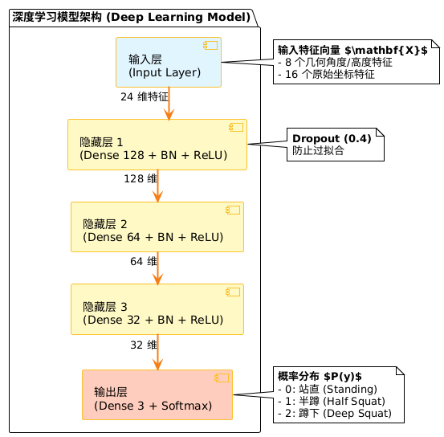

### 5.12.3.2 核心层数学原理

1. 全连接层 (Dense)

执行线性变换与非线性激活：

$$\mathbf{h} = \text{ReLU}(\mathbf{W}\mathbf{x} + \mathbf{b})$$

2. 批归一化 (Batch Normalization)

标准化输入分布，加速收敛：

$$\hat{x} = \frac{x - \mu_B}{\sqrt{\sigma_B^2 + \epsilon}} \cdot \gamma + \beta$$

3. 输出层 (Softmax)

将 logits 转换为概率分布 $P(y)$：

$$P(y_i) = \frac{e^{z_i}}{\sum_{j=1}^{C} e^{z_j}}$$

其中 $C=3$ 为类别总数。

### 5.12.3.3 模型参数统计

|**层级**|**类型**|**输出形状**|**参数量**|
|---|---|---|---|
|Input|InputLayer|(None, 24)|0|
|Hidden 1|Dense + BN|(None, 128)|3,456|
|Hidden 2|Dense + BN|(None, 64)|8,384|
|Hidden 3|Dense + BN|(None, 32)|2,144|
|Output|Dense (Softmax)|(None, 3)|99|
|**Total**|-|-|**~14,083**|

## 5.12.4 模型训练算法

### 5.12.4.1 损失函数与优化器

- 损失函数：稀疏分类交叉熵 (Sparse Categorical Crossentropy)

    $$L = -\frac{1}{N} \sum_{i=1}^{N} \log(P(y_i^{true}))$$

- **优化器**：Adam

    - 初始学习率 $\alpha = 0.001$

    - 一阶矩衰减 $\beta_1 = 0.9$

    - 二阶矩衰减 $\beta_2 = 0.999$

### 5.12.4.2 数据增强策略

为了提高模型的泛化能力，防止过拟合，训练过程采用了以下增强手段：

1. 高斯噪声注入

在关键点坐标上叠加随机噪声，模拟摄像头抖动：

$$\mathbf{x}_{aug} = \mathbf{x}_{orig} + \mathcal{N}(0, \sigma^2)$$

其中 $\sigma = 0.01$。

2. 水平翻转

通过对"左/右"关键点进行索引互换及 X 坐标镜像，将样本量扩充 2 倍。

3. SMOTE 过采样

在特征空间对少数类（如"半蹲"）生成合成样本，平衡数据集分布。

### 5.12.4.3 训练策略优化

1. 类别权重平衡：

    针对"半蹲"样本较少的情况，自动计算权重：

    $$w_j = \frac{N_{total}}{C \times N_j}$$

2. 早停机制 (Early Stopping)：

    监控验证集损失 $L_{val}$，若连续 patience=15 个 Epoch 不下降，则终止训练。

## 5.12.5 预测推理算法

### 5.12.5.1 推理数据流

预测过程是一个从原始关键点到语义状态的转化流水线。

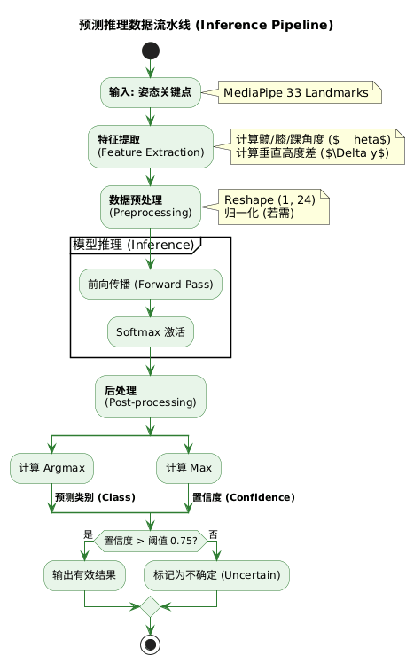

### 5.12.5.2 详细处理步骤

1. **输入接收**：接收 MediaPipe 每一帧的 `pose_landmarks`。

2. **特征提取**：调用 `extract_squat_features()` 获取 24 维向量。

3. **预处理**：执行 `reshape(1, 24)` 以匹配 batch 维度。

4. **前向传播**：模型输出 3 维概率向量 $[p_0, p_1, p_2]$。

5. **后处理与决策**：

    - 预测类别：$c = \operatorname{argmax}(p)$

    - 置信度：$conf = \max(p)$

## 5.12.6 结果平滑与去抖动

由于视频流输入存在波动，系统引入 **EMA 滤波器** 和 **状态迟滞切换** 机制。

### 5.12.6.1 指数移动平均滤波 (EMA)

对概率向量进行时间序列平滑：

$$\hat{P}_t = \alpha \cdot P_t + (1 - \alpha) \cdot \hat{P}_{t-1}$$

其中 $\alpha=0.7$。此操作能显著减少 UI 闪烁。

### 5.12.6.2 状态迟滞切换

为防止状态边界反复跳变，系统规定：仅当新状态的置信度**持续 3 帧**超过阈值 $0.7$ 时，才触发状态切换。

## 5.12.7 模型持久化与部署

1. 模型序列化

训练完成的模型被导出为 HDF5 (.h5) 格式，文件包含：

- 模型架构配置 (JSON)

- 权重参数矩阵 (Weights)

- 优化器状态（用于断点续训）

2. 运行时加载

后端服务启动时，SquatClassifier 单例类通过 TensorFlow/Keras API 加载模型文件至内存，并执行一次预热推理，输入全零向量，以消除首次请求的延迟。

## 5.12.8 算法验证与测试

模型性能通过混淆矩阵与 F1-Score 进行量化评估。

评估指标公式：

$$\text{Precision}_k = \frac{TP_k}{TP_k + FP_k}, \quad \text{Recall}_k = \frac{TP_k}{TP_k + FN_k}$$

$$F1_k = 2 \times \frac{\text{Precision}_k \times \text{Recall}_k}{\text{Precision}_k + \text{Recall}_k}$$

**基准性能要求**：

- 总体准确率 (Accuracy) $> 85\%$

- 单次推理耗时 (Latency) $< 15ms$

---

# 5.13 资源视角 (Resource Viewpoint)

资源视角描述系统对计算资源、存储资源及网络资源的占用与分配策略。本视角关注性能优化、资源限制及可扩展性设计。

## 5.13.1 计算资源

### 5.13.1.1 前端计算资源

**CPU 资源占用**：

- **MediaPipe 推理**：每帧约 10-15ms CPU 时间（30fps 下）
- **特征提取**：每帧约 1-2ms CPU 时间（24维特征向量计算）
- **深度学习推理**：每帧约 5-10ms CPU 时间（TensorFlow.js 模型前向传播）
- **结果平滑**：每帧约 0.5ms CPU 时间（EMA滤波、状态迟滞判断）
- **Canvas 渲染**：每帧约 2-3ms CPU 时间（绘制骨骼连线）

**总 CPU 占用**：约 18-30ms/帧，满足 30fps 要求（33.33ms/帧）

**GPU 资源占用**：

- **MediaPipe WASM**：利用 WebGL 加速，GPU 占用约 20-30%
- **Canvas 2D 渲染**：CPU 渲染，不占用 GPU

**内存资源占用**：

- **MediaPipe 模型**：约 5-8 MB（WASM 二进制）
- **TensorFlow.js 模型**：约 2-3 MB（深度学习模型权重）
- **React 应用**：约 10-15 MB（组件树、状态）
- **视频流缓冲**：约 2-3 MB（640×480 @ 30fps，1秒缓冲）
- **总内存占用**：约 20-30 MB

### 5.13.1.2 后端计算资源

**CPU 资源占用**：

- **Flask 请求处理**：平均 5-10ms/请求（简单 CRUD）
- **AI 代理调用**：异步处理，不阻塞主线程
- **深度学习推理引擎**：TensorFlow 推理，单次约 10-15ms（特征提取+模型推理）

**内存资源占用**：

- **Flask 应用**：约 50-100 MB（Python 运行时）
- **TensorFlow 模型**：约 200-500 MB（如加载 `.h5` 模型文件）
- **会话数据缓存**：约 10-50 MB（内存中暂存活跃会话）

**并发处理能力**：

- **Flask 单进程**：约 50-100 并发请求（Gunicorn 多进程可扩展）
- **数据库连接池**：最大 20 个连接

## 5.13.2 存储资源

### 5.13.2.1 前端存储

**LocalStorage**：
- **用户 Token**：约 500 bytes
- **用户偏好设置**：约 1-2 KB
- **总占用**：< 5 KB

**SessionStorage**：
- **临时会话数据**：约 10-50 KB（训练过程中的中间数据）

### 5.13.2.2 后端存储

**数据库存储（PostgreSQL）**：

**users 表**：
- 单条记录：约 500 bytes
- 10,000 用户：约 5 MB

**sessions 表**：
- 单条记录：约 2-5 KB（包含 JSONB 遥测数据）
- 100,000 会话：约 200-500 MB

**training_plans 表**：
- 单条记录：约 1-2 KB（JSONB AI 计划）
- 10,000 计划：约 10-20 MB

**总存储估算**：
- **小规模**（1,000 用户，10,000 会话）：约 50-100 MB
- **中规模**（10,000 用户，100,000 会话）：约 500 MB - 1 GB
- **大规模**（100,000 用户，1,000,000 会话）：约 5-10 GB

**文件存储**：
- **日志文件**：每日约 10-50 MB（按日志级别）
- **模型文件**（如使用）：约 200-500 MB（`.h5` 格式）

## 5.13.3 网络资源

### 5.13.3.1 前端网络流量

**初始加载**：
- **HTML**：约 10 KB
- **CSS**：约 50-100 KB
- **JavaScript Bundle**：约 500 KB - 1 MB（压缩后）
- **MediaPipe WASM**：约 5-8 MB（CDN 加载）
- **总初始加载**：约 6-10 MB

**运行时流量**：
- **API 请求**：平均 1-5 KB/请求
- **数据提交频率**：批量提交，每 5-10 秒一次，约 10-50 KB/批次
- **总运行时流量**：约 100-500 KB/分钟（取决于使用频率）

### 5.13.3.2 后端网络流量

**API 响应**：
- **认证接口**：约 500 bytes - 1 KB
- **会话接口**：约 1-5 KB
- **AI 接口**：约 2-10 KB（AI 返回文本）

**外部服务调用**：
- **智谱 AI API**：请求约 1-2 KB，响应约 2-5 KB
- **调用频率**：每用户每次训练结束调用一次

## 5.13.4 资源分配策略

### 5.13.4.1 前端资源优化

**代码分割（Code Splitting）**：
- 按路由懒加载组件，减少初始 bundle 大小
- MediaPipe 库按需加载，不阻塞首屏渲染

**资源缓存**：
- MediaPipe WASM 文件使用 CDN 缓存，减少重复下载
- API 响应使用 HTTP 缓存头，减少重复请求

**内存管理**：
- 及时释放视频流资源（`stream.getTracks().forEach(track => track.stop())`）
- 使用 `useCallback` 和 `useMemo` 避免不必要的重渲染

### 5.13.4.2 后端资源优化

**数据库优化**：
- **索引策略**：在 `user_id`, `session_id`, `created_at` 上创建索引
- **JSONB 索引**：对 `telemetry_log` 字段创建 GIN 索引，加速 JSON 查询
- **连接池**：复用数据库连接，减少连接开销

**缓存策略**：
- **会话数据缓存**：活跃会话数据暂存内存，减少数据库查询
- **AI 响应缓存**：相同输入参数的 AI 请求缓存结果（可选）

**异步处理**：
- AI 代理调用使用异步任务队列，不阻塞主请求线程
- 数据归档使用后台任务，避免影响实时性能

## 5.13.5 资源限制与扩展性

### 5.13.5.1 前端资源限制

**浏览器限制**：
- **内存限制**：约 2-4 GB（取决于设备）
- **存储限制**：LocalStorage 约 5-10 MB
- **并发请求限制**：同域约 6 个并发连接

**应对策略**：
- 使用 Web Workers 分担计算密集型任务
- 数据批量提交，减少 HTTP 请求频率
- 使用 IndexedDB 存储大量历史数据（如需要）

### 5.13.5.2 后端资源限制

**服务器限制**：
- **单进程并发**：约 50-100 请求/秒
- **数据库连接**：最大 20 个连接（可配置）

**扩展策略**：
- **水平扩展**：使用 Gunicorn 多进程 + Nginx 负载均衡
- **数据库扩展**：读写分离，主从复制
- **缓存层**：引入 Redis 缓存热点数据

## 5.13.6 资源监控图

```plantuml
@startuml
package "前端资源监控" {
  [CPU Usage] : MediaPipe: 10-15ms/帧
  [CPU Usage] : Feature Extraction: 1-2ms/帧
  [CPU Usage] : Deep Learning Inference: 5-10ms/帧
  [CPU Usage] : Smoothing: 0.5ms/帧
  [CPU Usage] : Rendering: 2-3ms/帧
  
  [Memory Usage] : MediaPipe: 5-8 MB
  [Memory Usage] : TensorFlow.js Model: 2-3 MB
  [Memory Usage] : React App: 10-15 MB
  [Memory Usage] : Video Buffer: 2-3 MB
  
  [Network] : Initial Load: 6-10 MB
  [Network] : Runtime: 100-500 KB/min
}

package "后端资源监控" {
  [CPU Usage] : Flask: 5-10ms/req
  [CPU Usage] : TensorFlow: 50-100ms/inference
  
  [Memory Usage] : Flask: 50-100 MB
  [Memory Usage] : TensorFlow: 200-500 MB
  [Memory Usage] : Session Cache: 10-50 MB
  
  [Database] : Users: ~5 MB/10K
  [Database] : Sessions: ~500 MB/100K
  [Database] : Plans: ~20 MB/10K
  
  [Network] : API Response: 1-5 KB/req
  [Network] : AI Call: 2-5 KB/call
}

@enduml
```

图5-31：系统资源占用概览图

## 5.13.7 性能基准

### 5.13.7.1 前端性能指标

| 指标 | 目标值 | 实际值 | 备注 |
|-----|--------|--------|------|
| 首屏加载时间 | < 3s | ~2-3s | 取决于网络速度 |
| 姿态检测延迟 | < 100ms | ~50-80ms | 浏览器内闭环（包含深度学习推理） |
| 帧率 | ≥ 30fps | ~30fps | 稳定运行 |
| 内存占用 | < 50 MB | ~20-30 MB | 正常使用 |

### 5.13.7.2 后端性能指标

| 指标 | 目标值 | 实际值 | 备注 |
|-----|--------|--------|------|
| API 响应时间 (P95) | < 200ms | ~100-150ms | 简单 CRUD |
| API 响应时间 (P99) | < 500ms | ~200-300ms | 包含数据库查询 |
| AI 接口响应时间 | < 30s | ~5-15s | 取决于网络 |
| 数据库查询时间 | < 50ms | ~20-40ms | 带索引查询 |
| 并发处理能力 | ≥ 50 req/s | ~50-100 req/s | 单进程 |

---

以上内容涵盖了 IEEE 1016 标准要求的 5.8 至 5.13 六个视角，每个视角都包含了详细的文字描述和 UML 图代码（PlantUML 格式）。您可以将这些内容添加到您的 SDD 文档中，并使用 PlantUML 工具渲染图表。

